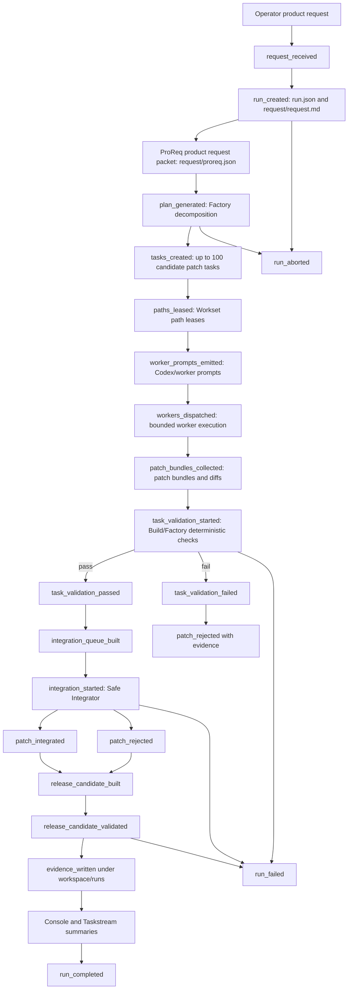

# Patch Swarm Lifecycle

This lifecycle is the product-level contract for Patch Swarm / Parallel Software Delivery. It maps the logical `workspace/runs/<run_id>/` artifact shape to the current implemented root, `workspace/runs/parallel-delivery/patch-swarm/<run_id>/`, until a future migration changes the physical path.



## Artifact Handoffs

| Stage | State or handoff | Artifact owner | Required artifacts |
| --- | --- | --- | --- |
| Intake | `request_received` | Operator and `cento parallel-delivery init` planned facade | `request/request.md` |
| Run creation | `run_created` | Parallel Delivery | `run.json`, `evidence/commands.log` |
| Product requirements | ProReq/product request packet | ProReq/Hard ProReq-compatible packet | `request/proreq.json` |
| Decomposition | Factory task decomposition | Factory or equivalent planner | `plan/decomposition.json`, `plan/task_graph.json`, `plan/risks.json` |
| Task bounding | Up to 100 candidate patch tasks | Parallel Delivery planner | task records with acceptance contracts |
| Path ownership | Workset path leasing | `cento workset` | `leases/path_leases.json` |
| Prompt emission | Codex/worker prompts | Parallel Delivery and Build prompt packet format | `prompts/task-0001.md`, prompt index |
| Worker execution | Bounded worker execution | Codex/Claude/API/fixture workers in isolated paths | `workers/<task_id>/state.json`, transcripts, evidence |
| Candidate collection | Patch bundles | Build/Workset/Patch Swarm normalizer | `patch.bundle.json`, `patch.diff` |
| Validation | Build validation and Factory `validate-fanout` | Build, Factory, deterministic validators | `validation/*.validation.json`, `validation/matrix.json` |
| Integration queue | Dependency or sequential order | Safe Integrator queue builder | `integration/queue.json` |
| Integration | Safe Integrator | Factory/Safe Integrator worktree path | `integrated-patches.json`, `rejected-patches.json`, `conflicts.json` |
| Release candidate | Release candidate | Factory release candidate path | `rc/release-candidate.json`, `rc/build.log`, `rc/validation.log` |
| Evidence | Durable run evidence | Parallel Delivery evidence renderer | `evidence/summary.md`, `evidence/artifacts.json`, `evidence/commands.log` |
| Visibility | Console/Taskstream summaries | Console, MCP, `cento agent-work` | summarized status, evidence path, next action |

## Required Lifecycle Stages

The docs and runtime slices must preserve these named stages, either as exact state names or explicit event names:

```text
request_received
run_created
plan_generated
tasks_created
paths_leased
worker_prompts_emitted
workers_dispatched
patch_bundles_collected
task_validation_started
task_validation_passed
task_validation_failed
integration_queue_built
integration_started
patch_integrated
patch_rejected
release_candidate_built
release_candidate_validated
evidence_written
run_completed
run_failed
run_aborted
```

## Terminal Outcomes

- `run_completed`: release candidate validation passed and durable evidence exists.
- `run_failed`: no safe patch can satisfy the request, release candidate validation fails, or mandatory evidence cannot be written.
- `run_aborted`: operator or admission controller stops the run before completion and records a reason.

Failed tasks do not necessarily fail a run. They become rejected task evidence when at least one safe patch can still integrate and the release candidate can satisfy the request.
